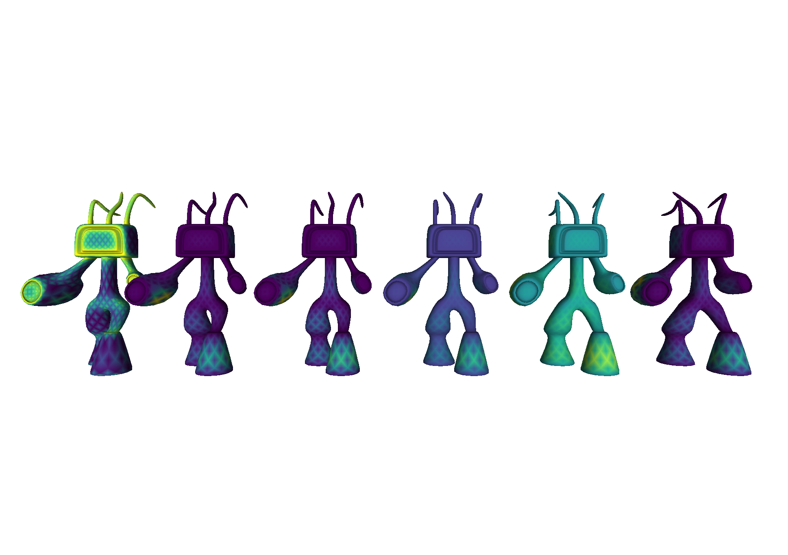
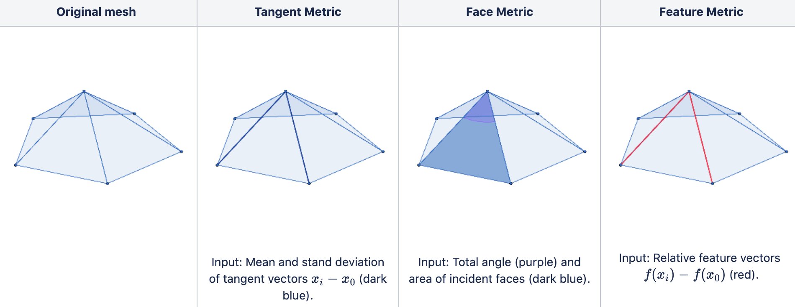

# MetricConv: An adaptive convolutional neural network for graphs and meshes


## Getting started 
This code was primarily developed with the following libraries on Python 3.6+:
* [PyTorch 1.5+](https://pytorch.org/)
* [PyTorch Geometric](https://github.com/rusty1s/pytorch_geometric)
* [trimesh](https://github.com/mikedh/trimesh) 

as well as with help from the following libraries: [numpy](https://numpy.org/), [pandas](https://pandas.pydata.org/), [matplotlib](https://matplotlib.org/), [tqdm](https://github.com/tqdm/tqdm).

### Installation
To get started, follow these steps:

**1. Clone the repo.**
Run the following in your console:
```bash
git clone https://github.com/eidosmontreal/shape-analysis.git
cd shape_analysis
export PYTHONPATH=$PWD:$PYTHONPATH
```

**2. Install the required dependencies.**
If you do not wish to install the dependencies separately, you can install them using [conda](https://docs.conda.io/en/latest/) environments via the following command:
```bash
$ conda env create -f environment.yml
```
*Note that this excludes PyTorch Geometric*. To install *PyTorch Geometric* we recommend following the steps outlined [here](https://pytorch-geometric.readthedocs.io/en/latest/notes/installation.html).
## MetricConv


MetricConv builds metric tensors at each vertex depending on local geometric statistics (refer to picture above). The type of local geometric statistics may be specified via the `info` parameter upon initialization of a `MetricConv` module. These metric tensors are used to determine local distances which are then used to construct attention matrices for graph/mesh convolution.  

------------------------------------------------------------------------
### Using MetricConv
After installing the required dependencies, it's easy to start using `MetricConv`. Initialization of a `MetricConv` module requires the number of input and output features, and most notably the type of metric to use (chosen among `vanilla`, `tangent`, `face`, `feature`), specified by the `info` parameter. A typical forward pass requires the input features, positions, edges, and faces. 

We refer the user to the example below.

```python
import torch
import torch.nn.functional as F
import torch.nn as nn

from torch_geometric.io import read_off
from torch_geometric.transforms import FaceToEdge

from models import MetricConv

class Net(nn.Module):
    def __init__(self):
        super(Net,self).__init__()
        self.cnn1 = MetricConv(3,32,info='face')
        self.cnn2 = MetricConv(32,3,info='face')
    def forward(self,feats,verts,edges,faces):
        x = self.cnn1(feats,verts,edges,faces)
        x = F.elu(x)
        out = self.cnn2(x,verts,edges,faces)
        return out

face_to_edge = FaceToEdge(False)
mesh = face_to_edge(read_off('meshes/chair.off'))
net = Net()
features = torch.ones(len(mesh.pos),3)
out = net(features,mesh.pos,mesh.edge_index,mesh.face.t())
```

Also included in `models/` is `architectures.py` which contains predefined architectures that comprise ``MetricConv`` blocks.

## Reproducing results

### Data
For the correspondence task, we used the Fine Alignment Using Scan Texture ([FAUST](http://faust.is.tue.mpg.de/)) dataset.

For the segmentation task, we use the [Shape COSEG](http://irc.cs.sdu.edu.cn/~yunhai/public_html/ssl/ssd.htm) dataset and [Human Body Segmentation](https://github.com/pixelite1201/pytorch_coma).

For details on downloading and setting up the datasets see `preprocess/`. The data therein is processed to be used in tandem with `datasets.py`.

### Experiments
After installing the data as described above, scripts for training models and reproducing experimental results can be found in `experiments/`, and should be run from the root directory. For example, to reproduce the reported training results for correspondence on the FAUST dataset, you would have to run:
```
bash experiments/faust_correspondence_resnet.sh
```
## Tests
One may test basic functionalities of this repo using [pytest](https://docs.pytest.org/en/stable/). In particular, after installing `pytest` (`$ pip install -U pytest
`), run the following:
```bash
$ pytest tests
```

## Acknowledgement
This library was developped by Bilal Abbasi while he was working at Eidos-Montreal and Eidos-Sherbrooke.
